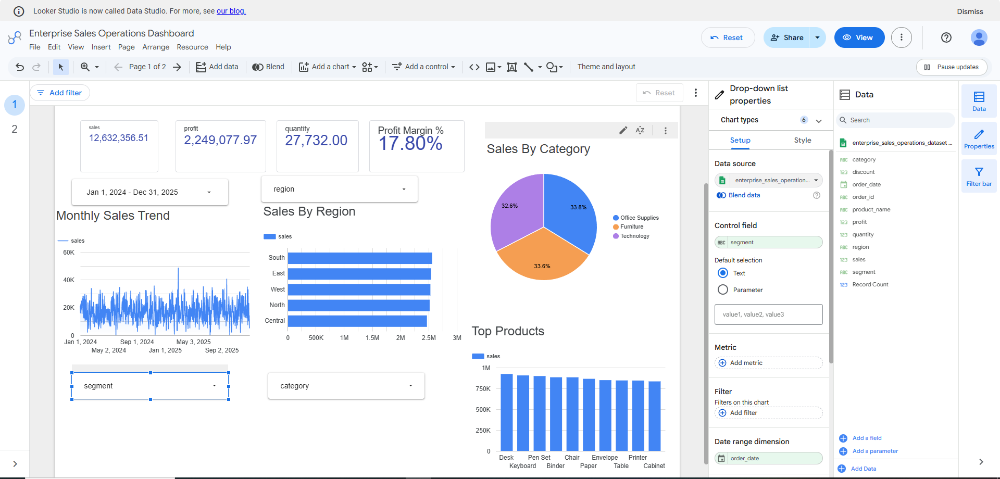
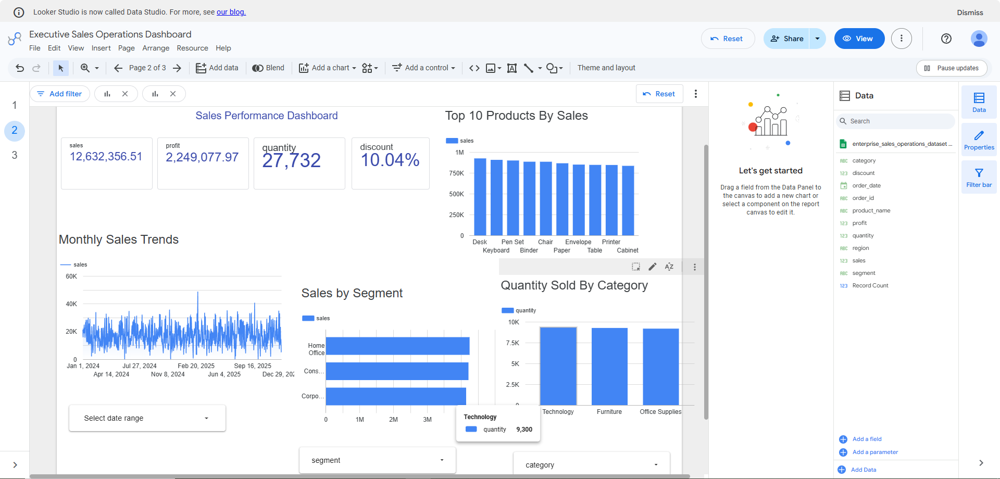
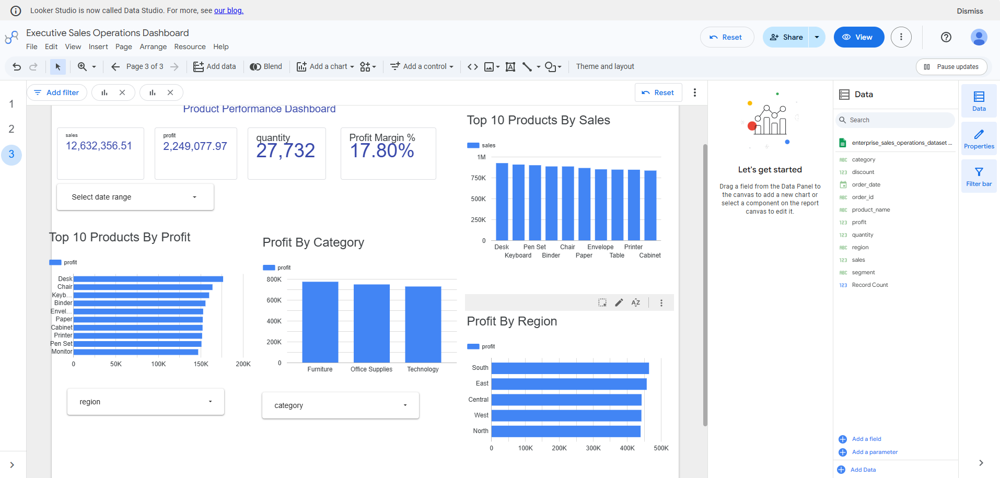

# Enterprise Sales Operations & Business Analysis Platform

## Project Overview

The Enterprise Sales Operations & Business Analysis Platform is an end-to-end Business Intelligence project demonstrating the complete lifecycle of business analysis, SQL analytics, dashboard development, testing, release management, and Agile project documentation.

The project simulates an enterprise reporting solution using a structured Agile Scrum methodology and delivers interactive dashboards to support business decision-making.

## Business Objectives

- Develop a centralized sales reporting solution.
- Monitor business performance using KPIs.
- Analyze sales, profitability, products, and regional performance.
- Support business decisions through interactive dashboards.
- Demonstrate an end-to-end Business Analyst and BI workflow.
- Project Scope

The project includes:

- Business Requirements Analysis
- Data Preparation
- SQL Analytics
- KPI Development
- Dashboard Development
- Functional Testing
- User Acceptance Testing
- Release Documentation
- Production Deployment
- Agile Project Management
- Technology Stack
- Solution Architecture
- Business Workflow
- Category	Technology
- Data Preparation	Microsoft Excel
- Database	MySQL
- SQL Development	MySQL Workbench
- Dashboard	Google Looker Studio
- Project Management	Jira
- Documentation	Confluence
- Version Control	Git & GitHub

## Agile Project Lifecycle

Sprint 1
Project Initiation

↓

Sprint 2
Data Preparation

↓

Sprint 3
SQL Analytics

↓

Sprint 4
Dashboard Development

↓

Sprint 5
Testing • Release • Deployment

## Solution Architecture

Raw Dataset

↓

Data Cleaning

↓

MySQL Database

↓

SQL Analytics

↓

Looker Studio

↓

Business Dashboards

↓

Business Insights

The solution architecture illustrates the end-to-end data flow from business data collection through storage, analytics, visualization, and business decision support.


## Business Workflow Diagram

```text
Business Need
      │
      ▼
Requirement Gathering
      │
      ▼
Business Analysis (BRD, User Stories)
      │
      ▼
Data Preparation (Excel)
      │
      ▼
MySQL Database
      │
      ▼
SQL Analytics
      │
      ▼
Looker Studio Dashboards
      │
      ▼
Testing (Functional + UAT)
      │
      ▼
Deployment & Release
      │
      ▼
Business Decision Making
```

The business workflow represents the project lifecycle, beginning with business requirements, followed by requirement analysis, data preparation, SQL analytics, dashboard development, testing, deployment, and business decision-making.

## Dashboard Suite

## Executive KPI Dashboard



### Features

- Total Sales
- Total Profit
- Profit Margin
- Quantity Sold
- Monthly Sales Trend

## Sales Performance Dashboard



### Features

- Sales Trend
- Segment Analysis
- Category Performance
- Product Sales
- Interactive Filters

## Product Performance Dashboard



### Features

- Product Profitability
- Regional Performance
- Top Products
- Category Analysis
- KPI Cards

## SQL Analytics

The project contains SQL scripts for:

- Executive KPI Development
- Sales Trend Analysis
- Product Performance
- Regional Analysis
- Profitability Analysis
- Data Validation
- Dashboard Dataset Preparation

## Project Deliverables

- Business Requirements Documentation
- SQL Scripts
- Dashboard Suite
- Jira Project
- Confluence Documentation
- Functional Testing
- User Acceptance Testing
- Release Documentation
- Production Deployment

## Repository Structure

```text
enterprise-sales-operations-business-analysis-platform/
│
├── README.md
├── LICENSE
├── .gitignore
│
├── architecture/
├── dataset/
├── documentation/
├── exported_query_results/
├── screenshots/
│   ├── confluence/
│   ├── jira/
│   ├── lookerstudio/
│   └── sql/
│
└── sql/
```

## Skills Demonstrated

- Business Analysis
- Requirements Gathering
- SQL
- MySQL
- Data Validation
- KPI Development
- Dashboard Design
- Looker Studio
- Jira
- Confluence
- Agile Scrum
- Reporting & Analytics
- Future Enhancements

## Version 2.0 may include:

- Automated ETL Pipeline
- PostgreSQL Support
- Oracle BI Integration
- Power BI Dashboard
- Tableau Dashboard
- Predictive Analytics
- Python Automation
- Advanced SQL Analytics

## Author

P.B. Rohit

Business Analyst | Data Analyst | Business Intelligence

GitHub: https://github.com/Rohit17-TVM

LinkedIn: https://www.linkedin.com/in/rohit-p-b-a04b87369/
